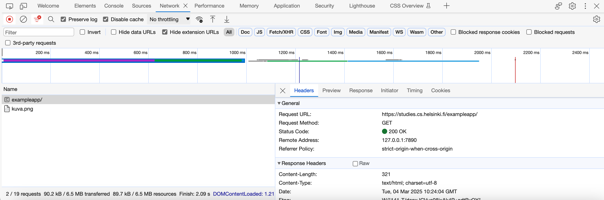
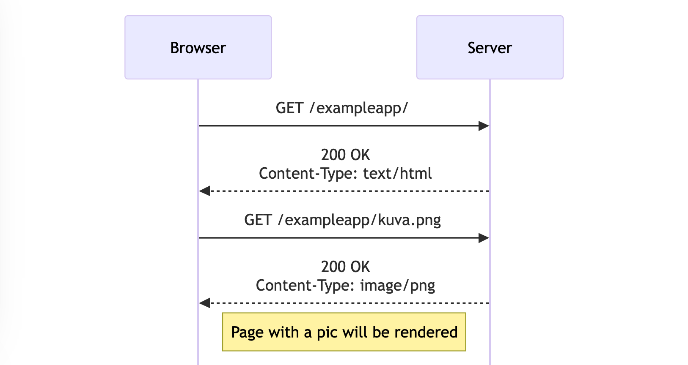
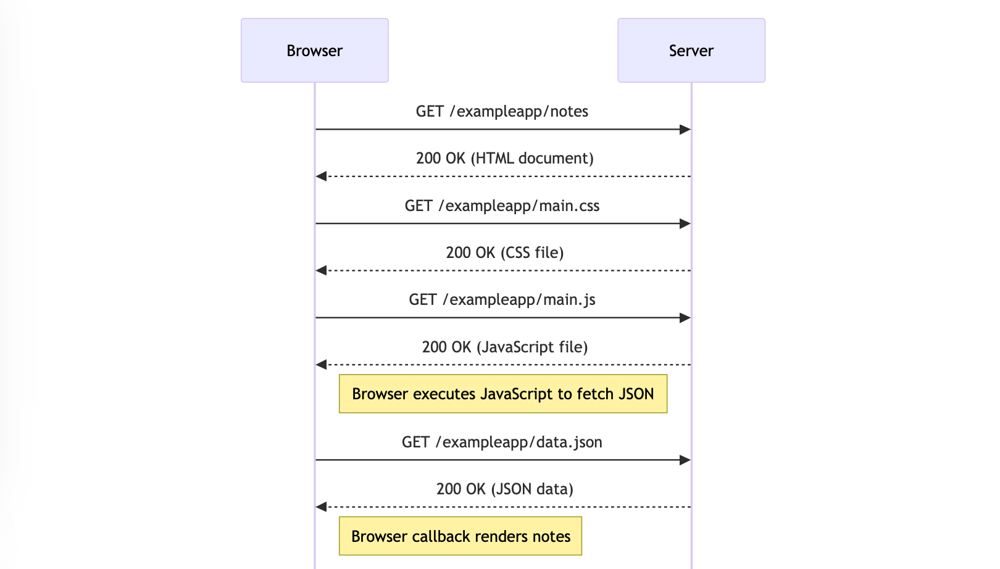

# Part 01 Fundamentals of Web apps

| Console | Sequence | Sequence |
|-|-|-|
|  |  |  |

- [x] **The 1st rule of web development**: Always keep the **Developer Console** (F12) open on your web browser. Make sure that the Network tab is open, and check the `Disable cache` option as shown. `Preserve log` can also be useful (it saves the logs printed by the application when the page is reloaded) as well as `Hide extension URLs`(hides requests of any extensions installed in the browser, not shown in the picture above). Install `JSONView` on Chrome.
- [x] We can think of HTML pages as implicit tree structures. Document Object Model, or DOM, is an Application Programming Interface (API) that enables programmatic modification of the element trees corresponding to web pages. You can access the `document` object by typing document into the `Console tab`! 
- [x] The Form tag has attributes `action` and method, which define that submitting the form is done as an `HTTP POST` request to the address `new_note`. Data is sent as the `body` of the POST request. `AJAX (Asynchronous JavaScript and XML)`  allows dynamic content updates on parts of a webpage without the need to rerender the full page. The `default` method would send the data to the server and cause a new `GET` request, **which we don't want to happen**. SPA-style websites don't fetch all of their pages separately from the server, but instead manipulate the contents of with JavaScript that executes in the browser. For example, the SPA version of the app does not traditionally send the form data:
```javascript
var form = document.getElementById('notes_form')
form.onsubmit = function(e) {
  e.preventDefault()

  var note = {
    content: e.target.elements[0].value,
    date: new Date(),
  }

  notes.push(note)
  e.target.elements[0].value = ''
  redrawNotes()
  sendToServer(note)
}
```
- Writing HTML amid the code is of course not smart, but for old-school PHP programmers, it was a normal practice. 
```javascript
const getFrontPageHtml = noteCount => {
  return `
    <!DOCTYPE html>
    <html>
      <head>
      </head>
      <body>
        <div class='container'>
          <h1>Full stack example app</h1>
          <p>number of notes created ${noteCount}</p>
          <a href='/notes'>notes</a>
          
        </div>
      </body>
    </html>
`
}

app.get('/', (req, res) => {
  const page = getFrontPageHtml(notes.length)
  res.send(page)
})
```
- The mechanism of invoking event handlers is very common in JavaScript. Event handler functions are called callback functions.
